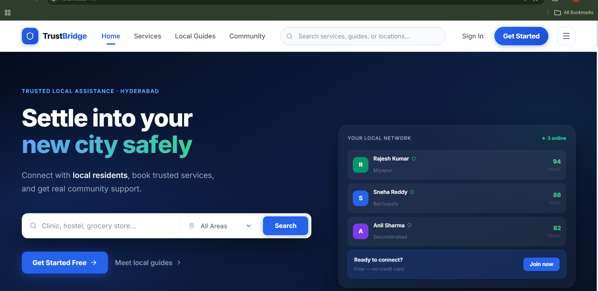
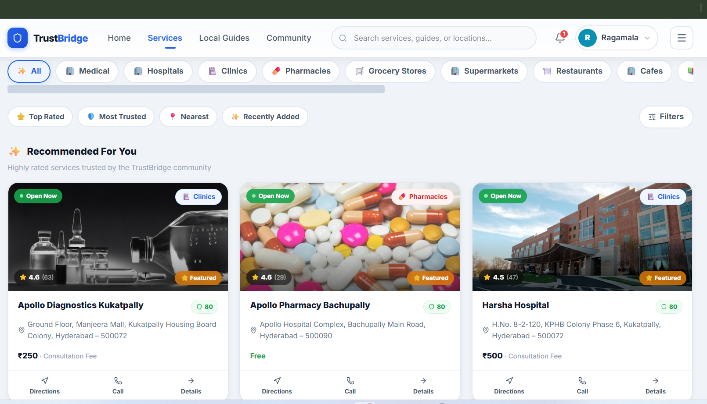
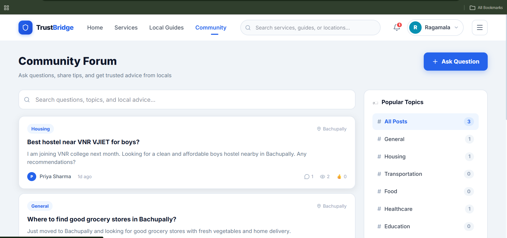
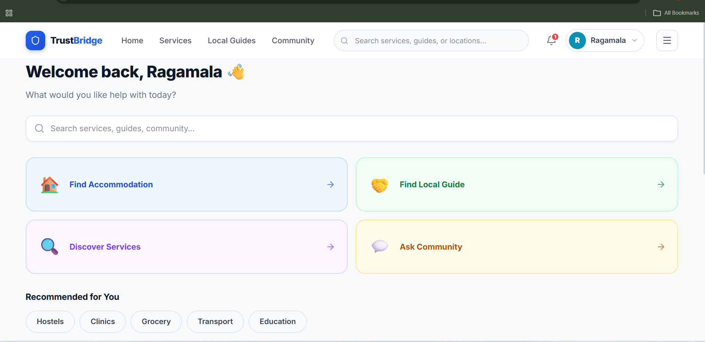
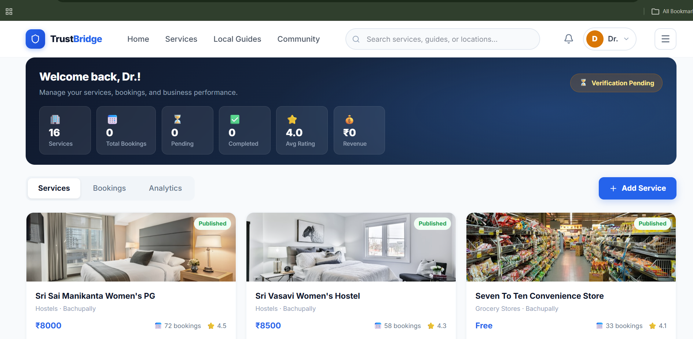

# TrustBridge

**Trusted Local Assistance Platform for Newcomers**

TrustBridge helps students, migrants, job seekers, and professionals settle into a new city by connecting them with verified local residents, trusted service providers, community support, and AI-powered verification systems.


## Features

### User Roles
- **Newcomer** — Search services, book appointments, chat with residents, leave reviews
- **Local Resident** — Identity verification, trust score, earn rewards, community Q&A
- **Service Provider** — Business verification, subscription plans, service listings, analytics
- **Admin** — Platform monitoring, fraud detection, user management, moderation

### Core Systems
- Multi-layer resident verification (OTP → Aadhaar → Selfie → Face Match → Address)
- Provider verification with OCR simulation, GST/Aadhaar validation, auto-scoring
- Subscription & payment system (Razorpay integration with mock mode for dev)
- Booking system with status tracking and notifications
- AI fake review detection (rule-based + ML scoring)
- Resident reward system based on trust score
- Real-time chat with Socket.io (typing indicators, read receipts)
- Community Q&A section
- Enterprise security (JWT, RBAC, rate limiting, input sanitization)

### Locations
Bachupally • Miyapur • Secunderabad (designed for multi-city expansion)

## Tech Stack

| Layer | Technology |
|-------|-----------|
| Frontend | React, Vite, Tailwind CSS, Framer Motion, Socket.io Client |
| Backend | Node.js, Express.js, Socket.io |
| Database | MongoDB, Mongoose |
| Auth | JWT + Refresh Tokens, Bcrypt |
| Payments | Razorpay |
| Storage | Cloudinary |
| AI/NLP | Natural.js (TF-IDF, fake review detection) |

## 📸 Project Screenshots

<p align="center">
  
  
</p>

<p align="center">
  
  
</p>

<p align="center">
  
  
</p>

## Quick Start

### Prerequisites
- Node.js 18+
- MongoDB running locally (or MongoDB Atlas connection string)

### Installation

```bash
# Install all dependencies
npm run install:all

# Copy environment file (already included for dev)
# Edit server/.env with your MongoDB URI and API keys

# Seed demo data
npm run seed

# Start backend (terminal 1)
npm run dev:server

# Start frontend (terminal 2)
npm run dev:client
```


## Project Structure

```
trustbridge/
├── client/                 # React frontend
│   ├── src/
│   │   ├── components/     # UI components & layout
│   │   ├── context/        # Auth & Socket contexts
│   │   ├── pages/          # Route pages & dashboards
│   │   └── services/       # API client
│   └── vite.config.js
├── server/                 # Express backend
│   ├── src/
│   │   ├── config/         # DB, Cloudinary config
│   │   ├── middleware/     # Auth, upload, error handling
│   │   ├── models/         # Mongoose schemas
│   │   ├── routes/         # API route handlers
│   │   ├── utils/          # Trust score, verification, AI detection
│   │   └── seed/           # Database seeder
│   └── .env.example
└── package.json
```

## API Overview

| Endpoint | Description |
|----------|-------------|
| `/api/auth` | Register, login, refresh tokens |
| `/api/users` | Profile, resident listings |
| `/api/verification` | Resident verification steps |
| `/api/providers` | Provider registration & analytics |
| `/api/services` | Service CRUD & search |
| `/api/bookings` | Booking management |
| `/api/reviews` | Reviews with fake detection |
| `/api/payments` | Subscription plans & Razorpay |
| `/api/community` | Q&A posts and answers |
| `/api/chat` | Conversations & messages |
| `/api/notifications` | In-app notifications |
| `/api/rewards` | Resident reward history |
| `/api/admin` | Admin dashboard & moderation |

## Environment Variables

See `server/.env.example` for all configuration options:

- `MONGODB_URI` — MongoDB connection string
- `JWT_SECRET` / `JWT_REFRESH_SECRET` — Authentication secrets
- `CLOUDINARY_*` — File upload (optional, uses placeholders in dev)
- `RAZORPAY_*` — Payment gateway (mock mode without keys)
- `CLIENT_URL` — Frontend URL for CORS

## Security

- JWT access tokens (15min) + refresh tokens (7 days)
- Bcrypt password hashing (12 rounds)
- Role-based access control on all protected routes
- Rate limiting (200 req/15min)
- MongoDB query sanitization
- Helmet security headers
- File type & size validation on uploads

## Production Deployment

1. Set `NODE_ENV=production` and strong JWT secrets
2. Configure MongoDB Atlas, Cloudinary, and Razorpay credentials
3. Build frontend: `cd client && npm run build`
4. Serve static files via Express or CDN
5. Enable HTTPS and update CORS origins

## License

ISC
